# Data Lovers - Studio Ghibli

Segundo projeto criado junto ao bootcamp da Laboratória, visando criar uma plataforma que exibisse um conjunto de dados, de acordo com a temática escolhida.

## Índice

* [1. Resumo do projeto](#1-resumo-do-projeto)
* [2. Histórias de usuários](#2-histórias-de-usuários)
* [3. Interface](#3-interface)
* [4. Protótipo de baixa fidelidade](#4-protótipo-de-baixa-fidelidade)
* [5. Protótipo de alta fidelidade](#5-protótipo-de-alta-fidelidade)
* [6. Testes de usabilidade](#6-testes-de-usabilidade)
* [7. Considerações técnicas](#7-considerações-técnicas)
* [8. Objetivos alcançados](#8-objetivos-alcançados)
* [9. Contatos](#9-contatos)

***

## 1. Resumo do projeto

O objetivo principal deste projeto foi aprender a desenhar e construir uma interface web onde se possa visualizar e manipular dados, entendendo o que o usuário necessita.

O tema escolhido foi Estúdio Ghibli e o site é destinado aos fãs do estúdio e às pessoas que querem conhecer mais sobre ele. A interface web permite que o usuário veja informações sobre as animações do estúdio, como sinopse, personagens e quais os diretores de cada uma.

## 2. Histórias de usuários

**História do usuário 1:** “Como usuário, quero encontrar informações sobre as animações, como quantas são e quais são os seus nomes, para que eu possa conhecer novas produções”.

* Na página de início colocar as informações do estúdio e de quantos filmes são.

* Ao clicar no botão para entrar no site, o usuário verá os pôsteres dos filmes e poderá obter as informações sobre eles.

**História do usuário 2:** “Como usuário, quero saber em quantas e quais animações cada diretor participou, para entender melhor o estilo de cada um e ver qual me agrada mais”.

* Na página de filmes, criar um filtro para os diretores.

* Com o cálculo agregado, colocar na tela quantos filmes cada diretor produziu.

**História do usuário 3:** “Como usuário, gostaria de saber informações sobre cada animação, como descrição, data de lançamento, diretor e personagens”.

*Cada filme será colocado em um card, com informações na frente e no verso. A parte da frente conterá o pôster e o nome de cada animação, assim como o diretor e a data de lançamento de cada uma. O verso conterá a sinopse da animação.

*Para ver as informações do verso do card basta passar o cursor em cima de cada um, que ele irá girar e mostrar a parte de trás.

*O site terá uma página específica para cada personagem, que serão mostrados de acordo com cada filme.

**História do usuário 4:** “Como usuário, gostaria de ver quais e quantos são os personagens de cada animação”.

*Com o cálculo agregado, colocar quantos personagens cada filme possui.

*O site terá uma página específica para cada personagem, que poderão ser mostrados a partir de cada filme.

**História do usuário 5:** "Como usuário, quero saber características específicas dos personagens, tais como nome, idade, sexo, espécie, para poder me sentir mais conectada com eles".

*Na página de "personagens", criar cards para cada um deles.

*A parte da frente do card irá mostrar a imagem, o nome e o filme a qual eles pertencem. O verso mostrará o gênero, a idade, cor dos olhos e cabelo, e a espécie de cada personagem.

*Ao repousar o cursor sobre a imagem, o card vai virar e revelar as características do personagem.

**História do usuário 6:** "Como usuário, quero saber em quais locais as histórias se passam e quais veículos aparecem, para que o contexto do filme e o universo criado fiquem mais ricos e palpáveis"

*Na página de "locais e veículos", criar cards para cada um deles, mostrando a imagem, o nome e a qual filme pertencem.

## 3. Interface

Todo o projeto foi pensado para ser o mais intuitivo e visualmente agradável possível e, para isso, buscamos sempre manter em mente alguns pontos:

**1.** *O uso de tons azulados e suaves*, que remetiam às paisagens acolhedoras e quase paradísiacas presentes nas obras do Estúdio Ghibli.

  
Paleta de cores

  
 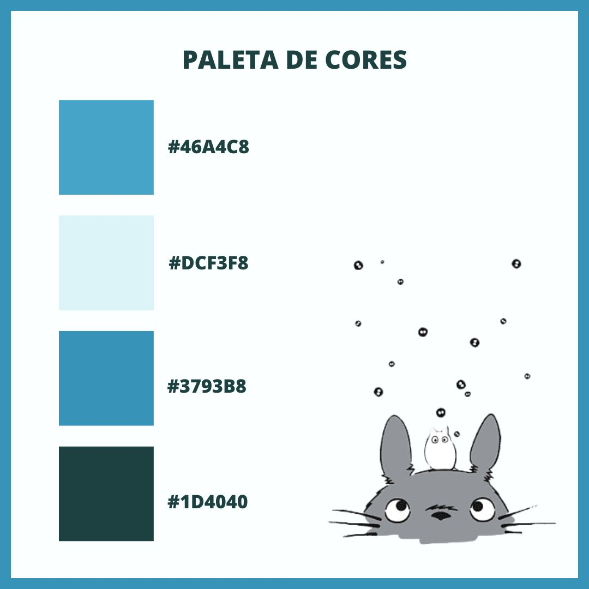
  

**2.** *O uso de formas arredondadas*, que buscavam trazer delicadeza à página.

  
Página de filmes

  
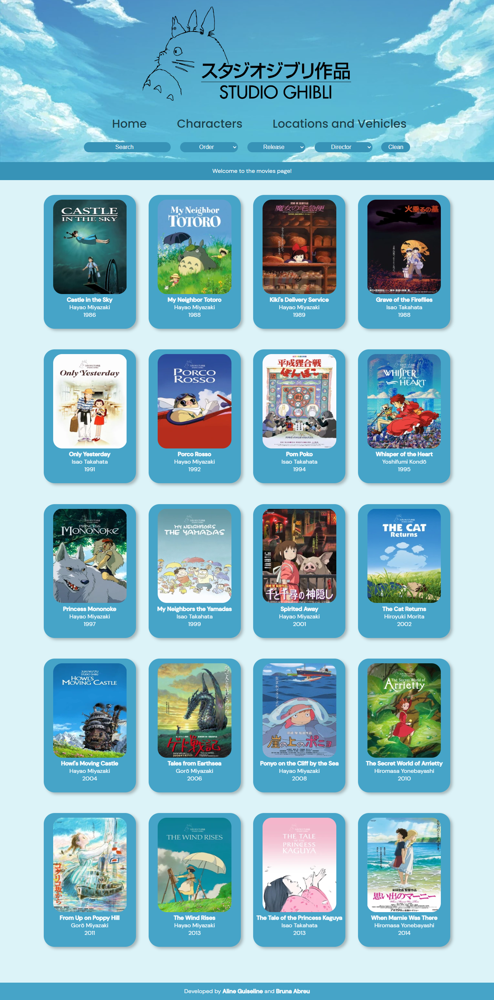
  

**3.** *Agrupamento de informações*, para facilitar a busca.

  
Página de personagens

  
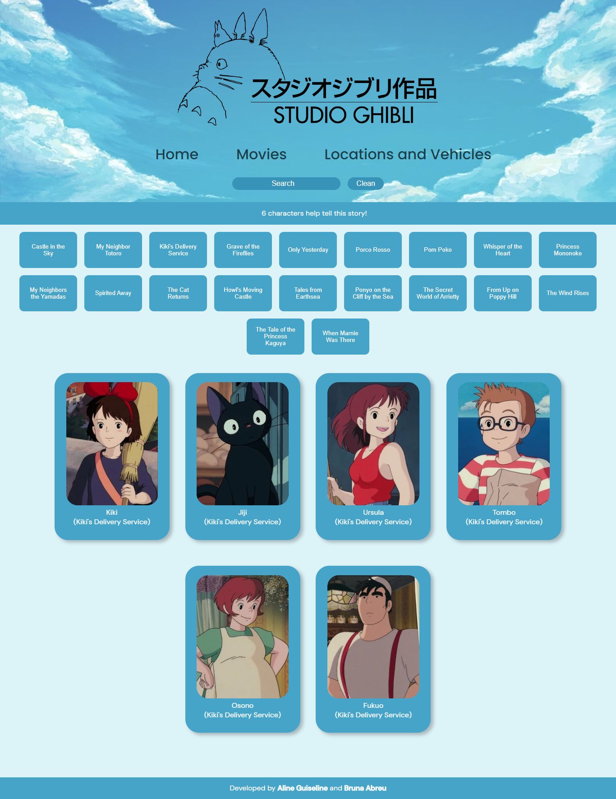
  

**4.** *A busca por padronização e organização*, a fim de oferecer uma navegação descomplicada e descontraída.

  
Página de locais e veículos

  
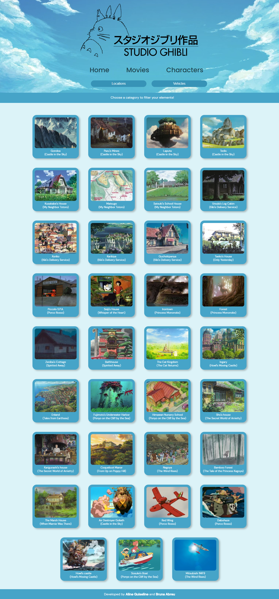
  

**5.** *Uso de ferramentas intuitivas*, para tornar a navegação mais acessível (para visualizar maiores informações a respeito dos filmes e dos personagens, o usuário precisa apenas passar o cursor sobre o card).

  
Card de personagens

  
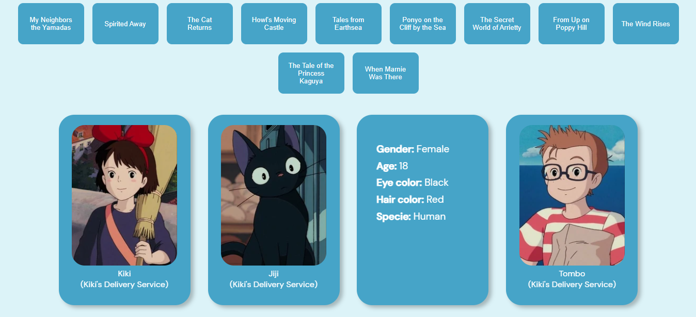
  

  
Card de filmes

  
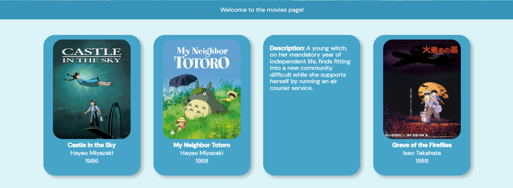
  

**6.** *Uso de filtros, barras de buscas e botões de seleção*, para tornar a busca mais personalizada e precisa.

  
Filtros dos filmes

  
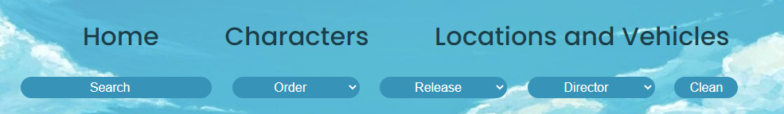
  

  
Botões de seleção dos personagens

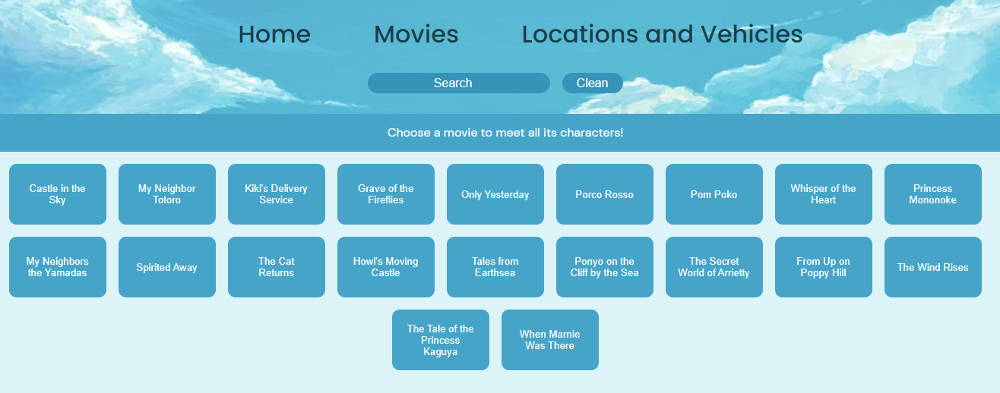

**7.** *Responsividade para todos os dispositivos*, para que os usuários possam descobrir mais sobre os seus filmes favoritos ou sobre títulos a conhecer na comodidade de seus celulares ou tablets.

  
Visualização responsiva

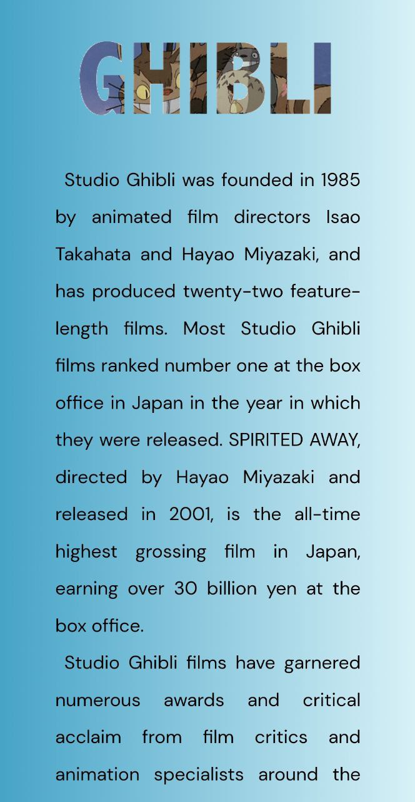
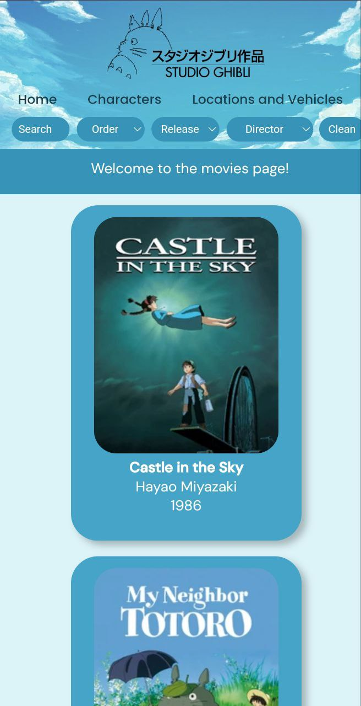
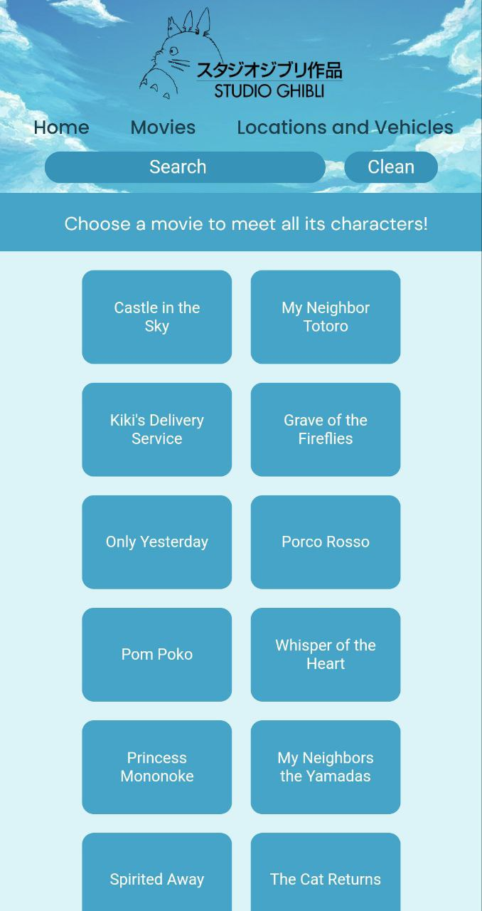
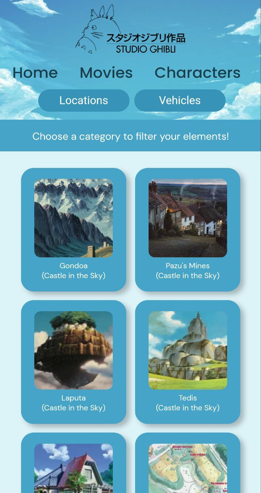

**8** *A mentalidade "menos é mais"*, proporcionada pelos nossos usuários-testes.

  
Página inicial

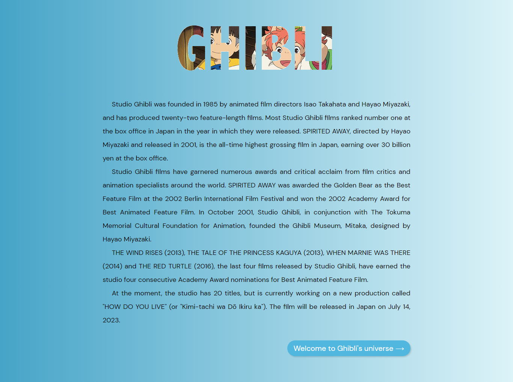

## 4. Protótipo de baixa fidelidade

Criado no Canva, o protótipo de baixa fidelidade serviu como um bom guia, sendo seguido, praticamente, à risca.

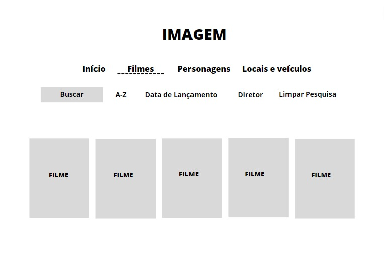

## 5. Protótipo de alta fidelidade

O protótipo de alta fidelidade foi criado no Figma e completou, em design e funções, o de baixa fidelidade. No entanto, ao longo do desenvolvimento do projeto e devido aos testes de usabilidade realizados, algumas alterações mostraram-se necessárias.

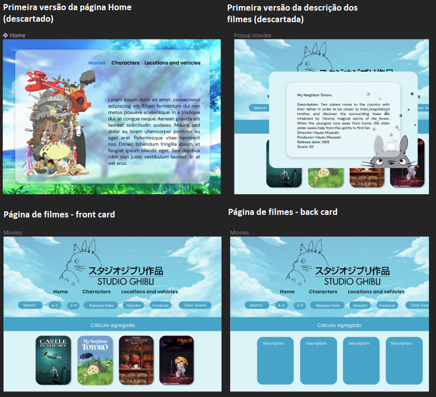
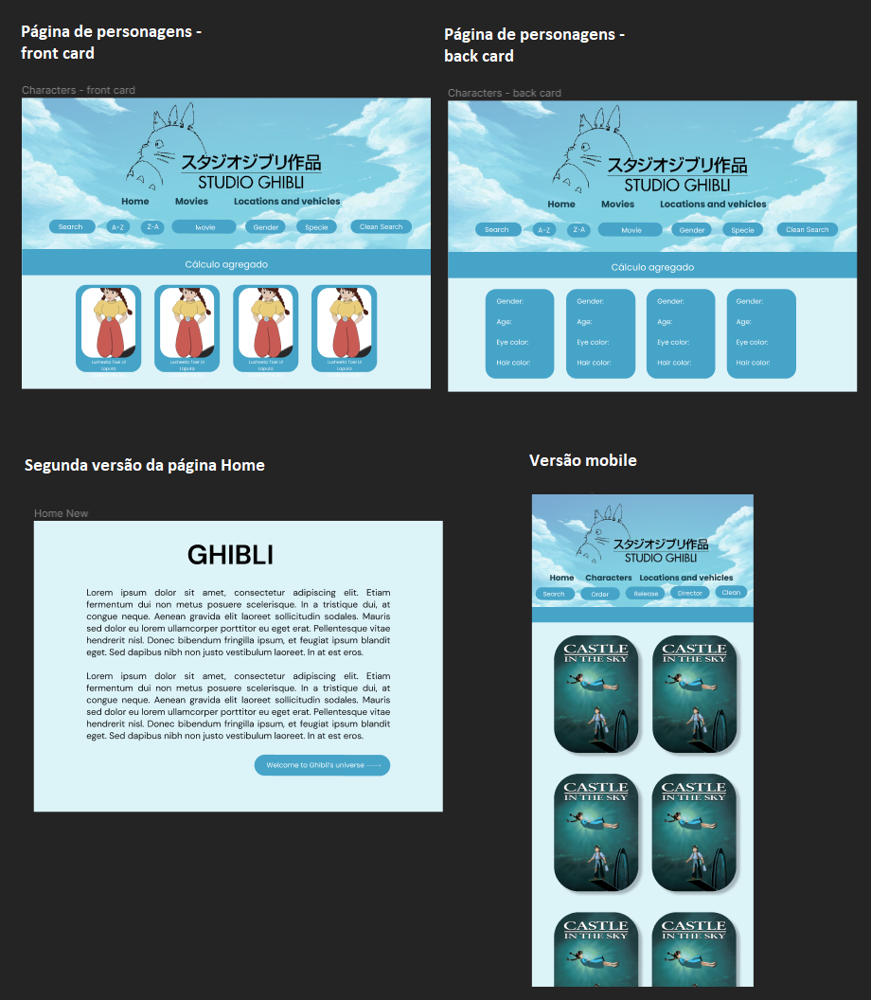
## 6. Testes de usabilidade

Enquanto montávamos o protótipo do projeto no Figma, utilizamos a função "Present", que permite criar um protótipo navegável, e pedimos para que algumas pessoas próximas testassem o projeto, dando suas opiniões sobre o design e sobre a usabilidade. Os feedbacks foram positivos, mas algumas mudanças foram sugeridas, tais como alteração da fonte do texto (para harmonizar com a fonte escolhida para o menu), alteração na cor do fundo (a fim de cansar menos os olhos) e a retirada o negrito dos filtros e do menu (buscando trazer mais leveza ao site).

Ao longo do desenvolvimento, voltamos a fazer os testes e alguns dos usuários-testes mostraram-se incomodados com a página de personagens, apontando que o fato de todos os cards estarem dispostos tornava a tela visualmente poluída e bagunçada. Desta forma, reformulamos o design e optamos por deixar fixos somente botões com os nomes de cada filme, deixando para que o usuário clicasse em cada título e visualizasse os seus personagens.

Além da página de personagens, também reclamaram da tela de Home, apontando que estava bonita, mas incoerente com as outras páginas, pois não tinha muita ligação visual com elas. Sendo assim, achamos melhor deixar a página inicial mais minimalista, para que não houvesse conflito entre as outras partes do projeto.

## 7. Considerações técnicas

**Linguagens utilizadas:** JavaScript | HTML5 | CSS3

**Programas/Plataformas utilizadas:** VSCode (codificação) | Canva (protótipo de baixa fidelidade e imagem com a paleta de cores) | Figma (protótipo de alta fidelidade) | Trello (planejamento)

## 8. Objetivos alcançados

✨ Desenvolvimento de uma plataforma que permita ao usuário visualizar, filtrar e conhecer os filmes do Estúdio Ghibli, bem como os seus personagens, locais e veículos
✨ Criação de histórias de usuário e construção do site de acordo com estas histórias
✨ Desenvolvimento do projeto de acordo com os testes de usabilidade realizados com usuários reais
✨ Páginas 100% responsivas
✨ Criação e validação de testes unitários para as funções criadas no código

## 9. Contatos

**Aline Guiseline**
💙 https://www.linkedin.com/in/alineguiseline/

**Bruna Abreu**
💙 https://github.com/bruna-abreu